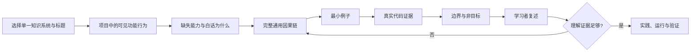

<p align="center">
  
  
  
</p>

<h1 align="center">Adaptive Teaching</h1>

<p align="center"><strong>先选定一个知识系统，再把项目现象转换成可迁移的因果理解。</strong></p>

<p align="center">
  一套面向中文初学者的 Codex 教学 Skill。<br>
  它不把项目导览冒充成教学：先完成一节单概念课，再用真实代码验证理解。
</p>

<p align="center">
  <a href="#quick-start">快速开始</a> ·
  <a href="#what-changed-in-this-version">本版变化</a> ·
  <a href="#teaching-loop">教学循环</a> ·
  <a href="#verification">验证方式</a>
</p>

<p align="center">
  <a href="https://github.com/angshihan777-droid/adaptive-teaching/stargazers">
    
  </a>
  <a href="LICENSE">
    
  </a>
</p>

## Why

很多项目教学从文件清单、框架名称和代码逐行解释开始。初学者因此需要先猜测一整个系统，再被告知名词和结论；即使项目能运行，也没有形成可迁移的因果理解。

Adaptive Teaching 把项目当作证据，而不是课堂目录：

```text
选择唯一知识系统与标题
    -> 可见功能行为
    -> 缺失能力与“为什么”
    -> 完整通用因果链
    -> 最小例子
    -> 真实代码证据
    -> 正常路径、失败边界与非目标
    -> 学习者用自己的话解释
```

项目是实践载体，技术理解才是目标，AI 只是辅助工具。

## What Changes

| 普通代码讲解 | Adaptive Teaching |
|---|---|
| 先列出目录和文件职责 | 先从学习者能看见的功能行为提出问题 |
| 把“为什么”当作课堂结束时的提问 | 把“为什么”作为教学起点，随后给出完整机制 |
| 默认学习者认识端口、框架和日志 | 把观察和技术解释明确分开 |
| 看到代码就逐行讲 | 先讲通用概念，再用代码验证 |
| 一章同时深挖 FastAPI、React、HTTP 和 Agent | 一章只深入一个知识系统 |
| 代码调用顺序充当解释 | 代码调用顺序只作为已学概念的证据 |
| 以“代码写完”作为学习完成 | 以学习者能解释、应用和验证作为证据 |

## What Changed In This Version

这一版不只是补充了“现象优先、概念先于代码”的原则，而是把它变成可执行、可检查的课堂结构。它专门修复两类课堂退化：标题无法说明到底在学什么，以及提出一个“为什么”后就把完整推理任务交给初学者。

| 旧版倾向 | 当前版本 |
|---|---|
| 从项目现象开始，但可能没有先确定本节知识对象 | 先选择唯一知识系统、标题、可见行为、缺失能力和非目标 |
| “为什么”问题可能过早变成学习者作答 | “为什么”只用于建立学习需要；完整通用链和最小例子在提问前完成 |
| `server.py -> index() -> FileResponse` 容易成为正文结构 | 通用角色与因果链先出现，文件与函数只证明其中的一步 |
| 依靠教学原则自觉避免跑题 | 使用课堂模板、质量闸门和回归用例检测标题、顺序和边界 |

本版的第一响应必须形成一节完整的单概念课，而不是“项目观察 + 开放问题”。课堂末尾才让学习者解释已经教清楚的链路。

## Core Principles

### Choose the concept before the lesson

先从项目证据中确定这一节只教哪一套可迁移知识，再写标题。标题必须让学习者在不知道仓库文件名的情况下，也能判断会学到什么。

```text
Good: 【HTTP】请求、响应与前后端数据传递
Good: 【Web 应用】浏览器、服务程序与网页文件的分工
Bad: FastAPI + React 启动流程
Bad: 为什么 server.py 能显示网页？
```

“页面能出现”和“点击后数据怎样传递”可以出现在同一个项目，却属于不同的课堂。

### Feature behavior first

每章从学习者能直接做或看见的功能行为开始，例如点击按钮后页面显示结果。接着说明：这个页面或程序本身缺少什么能力，因此才产生“为什么”。命令、目录和框架名称不是默认开场；只有当它们本身就是本节对象时才使用。

### Concept before code

陌生术语按以下顺序进入课堂：

```text
它解决什么眼前问题
    -> 白话定义
    -> 它在当前链路的哪一步
    -> 一个最小例子
    -> 准确的技术名称和项目证据
```

完整的通用因果链与最小例子必须都在源码标识符之前出现。学习者不应该先猜整个系统，再得到答案。

### One system per lesson

整体协作关系可以展示，但一章只深入一个知识系统。比如 FastAPI 课可以说它把网页文件交给浏览器；浏览器如何组织组件树，留给独立的前端课。

### Learner takes the turn last

讲完概念、最小例子和有限的项目证据后，才让学习者用自己的话解释输入、输出、调用顺序、责任边界和失败情况。问题只检查课堂已经教过的因果链。

## Teaching Loop



简单问题可以压缩；难点必须补回缺失的中间环节。

## Quick Start

### Install or clone

在 Codex 中使用本地 Skill：

```bash
git clone https://github.com/angshihan777-droid/adaptive-teaching.git \
  "$CODEX_HOME/skills/adaptive-teaching"
```

如果当前环境已经配置了 Codex Skills，也可以把仓库内容放到：

```text
~/.codex/skills/adaptive-teaching/
```

### Start a lesson

```text
使用 $adaptive-teaching，按照下面的学习计划继续教学：

<学习计划路径>

我是初学者。请先读取学习计划和当前进度，再从项目中能直接看到的功能行为开始。
先确定本节唯一的知识系统和标题；先讲完整通用概念与最小例子，再用真实代码验证。
```

### Continue a lesson

```text
使用 $adaptive-teaching，继续上一节。
请先读取当前学习进度，保持“功能行为 -> 缺失能力 -> 通用因果链 -> 最小例子 -> 代码证据 -> 学习者复述”的顺序。
```

## Folder Layout

```text
adaptive-teaching/
├── SKILL.md                         # 触发条件、路由与核心课堂约束
├── agents/openai.yaml               # Codex 界面元数据和默认提示
├── references/
│   ├── learner-profile.md           # 学习者特点与教学偏好
│   ├── lesson-workflow.md           # 从选定知识系统到学习者复述的课堂流程
│   ├── guided-lesson-template.md    # 第一响应的完整单概念课模板
│   ├── lesson-quality-gate.md       # 标题、顺序、边界和提问时机的质量闸门
│   ├── task-anchor.md               # 当前课程目标、边界和完成证据
│   ├── classroom-harness.md         # 课堂行为自检
│   ├── ai-practice.md               # AI 协作实践阶段
│   ├── interview-stage.md           # 目标岗位与面试阶段
│   ├── skill-design.md              # Skill 的维护与分层原则
│   ├── 正确教学示例.md              # 正向课堂样例
│   └── 错误教学示例.md              # 需要避免的课堂模式
├── evals/
│   └── evals.json                   # 防止课堂退化的回归用例
├── CHANGELOG.md
├── LICENSE
└── README.md
```

## Progressive Disclosure

`SKILL.md` 是导航中心，不是百科全书。

```text
始终需要的触发和边界
    -> SKILL.md

当前完整课堂需要的学习者画像、流程、模板和质量闸门
    -> references/learner-profile.md
    -> references/lesson-workflow.md
    -> references/guided-lesson-template.md
    -> references/lesson-quality-gate.md

当前阶段需要的任务锚点、AI 实践或面试规则
    -> 按需读取对应 reference
```

## Scope And Boundaries

适合：

- 通过真实仓库学习后端、前端、HTTP、Agent 和工程实践
- 初学者概念解释和代码调用链追踪
- 在学习基础上进行小范围 AI 辅助实践
- 课程阶段总结、理解检查和目标岗位面试练习

不自动做：

- 把目录清单当成教学
- 把一个“为什么”问题当成完整课程
- 要求初学者解释尚未教过的整条因果链
- 用函数或文件调用顺序替代概念解释
- 未经请求修改长期学习路线
- 在一节课里同时深挖多个技术系统
- 把“项目能运行”当成“学习者已经理解”

## Verification

Skill 结构校验：

```powershell
$env:PYTHONUTF8 = "1"
python <skill-creator>/scripts/quick_validate.py <path-to-adaptive-teaching>
```

课堂行为校验重点：

- 标题是否明确写出本节唯一的知识点？
- 课前现象是否为可见功能行为，并说明了它缺少的能力？
- 是否先讲完整通用因果链和最小例子，再出现代码标识符？
- 是否明确排除了相邻知识系统？
- 是否在教学完成后才让学习者解释已讲过的因果链？
- 项目代码是否真正验证了前面讲过的概念？

回归用例位于 `evals/evals.json`。它以 `suan` 项目的首课为例，检查结果不会退化为“启动命令 + 开放问题”或“文件调用序列”。

## Design Note

这套 Skill 遵循三个维护层：

```text
Prompt  -> 定义老师怎么教
Context -> 提供学习者、课程和项目背景
Harness -> 检查老师有没有按约定教学
```

结构可以复用，内容必须从当前项目重新生成。

## License

MIT License. See [LICENSE](LICENSE).
