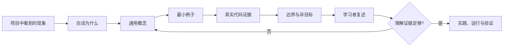

<p align="center">
  
  
  
</p>

<h1 align="center">Adaptive Teaching</h1>

<p align="center"><strong>从项目中看见问题，把现象一步步转换成可迁移的技术知识。</strong></p>

<p align="center">
  一套面向中文初学者的 Codex 教学 Skill。<br>
  它不把项目交付冒充成学习，而是先建立概念，再用真实代码验证理解。
</p>

<p align="center">
  <a href="#quick-start">快速开始</a> ·
  <a href="#teaching-loop">教学循环</a> ·
  <a href="#folder-layout">目录结构</a> ·
  <a href="#verification">验证方式</a>
</p>

<p align="center">
  <a href="https://github.com/angshihan777-droid/adaptive-teaching/stargazers">
    
  </a>
  <a href="LICENSE">
    
  </a>
</p>

## Why

很多项目教学从文件清单、框架名称和代码逐行解释开始。初学者看到的却只是陌生文件、陌生终端文字和陌生术语，最后记住了名词，却没有形成因果理解。

Adaptive Teaching 采用另一条路径：

```text
学习者能直接看到的项目现象
    -> 用白话提出“为什么会这样”
    -> 先学习解决问题所需的通用概念
    -> 用最小例子理解输入、处理和输出
    -> 回到真实代码寻找证据
    -> 让学习者用自己的话解释
```

项目是实践载体，技术理解才是目标，AI 只是辅助工具。

## What Changes

| 普通代码讲解 | Adaptive Teaching |
|---|---|
| 先列出目录和文件职责 | 先从学习者能看见的现象提出问题 |
| 默认学习者认识端口、框架和日志 | 把观察和技术解释明确分开 |
| 看到代码就逐行讲 | 先讲通用概念，再用代码验证 |
| 一章同时深挖 FastAPI、React、HTTP 和 Agent | 一章只深入一个知识系统 |
| 以“代码写完”作为学习完成 | 以学习者能解释、应用和验证作为证据 |
| 规则写在一份越来越长的提示里 | 入口规则、学习者背景、课堂流程和检查机制按需分层 |

## Core Principles

### Project phenomenon first

每章从一个真实项目现象开始：一个页面、按钮、输入框、目录、命令或终端输出。先说明现在看到了什么，再提出自然的“为什么”。

### Concept before code

陌生术语按以下顺序进入课堂：

```text
它解决什么眼前问题
    -> 白话定义
    -> 它在当前链路的哪一步
    -> 一个最小例子
    -> 准确的技术名称和项目证据
```

### One system per lesson

整体协作关系可以展示，但一章只深入一个知识系统。比如 FastAPI 课可以说它把 React 构建文件交给浏览器；React 如何挂载组件树，留给独立的 React 课。

### Reusable structure, fresh content

课堂结构可以复用，但项目现象、调用链、代码证据和问题不能预制。每次课程都从当前项目重新观察。

### Learner takes the turn

讲完概念和证据后，先让学习者用自己的话解释输入、输出、调用顺序、责任边界和失败情况，再决定是否进入实现。

## Teaching Loop



这不是一套机械仪式。简单问题可以压缩；难点必须补回缺失的中间环节。

## Quick Start

### Install or clone

在 Codex 中使用本地 Skill：

```bash
git clone https://github.com/angshihan777-droid/adaptive-teaching.git \
  "$CODEX_HOME/skills/adaptive-teaching"
```

如果当前环境已经配置了 Codex Skills，也可以把仓库内容放到：

```text
~/.codex/skills/adaptive-teaching/
```

### Start a lesson

```text
使用 $adaptive-teaching，按照下面的学习计划继续教学：

<学习计划路径>

我是初学者。请先读取学习计划和当前进度，再从项目中能直接看到的现象开始。
先讲通用概念，再用真实代码验证；一章只深入一个知识系统。
```

### Continue a lesson

```text
使用 $adaptive-teaching，继续上一节。
请先读取当前学习进度，保持“项目现象 -> 通用概念 -> 最小例子 -> 代码证据 -> 学习者复述”的顺序。
```

## Folder Layout

```text
adaptive-teaching/
├── SKILL.md                         # 触发条件、路由和教学不变量
├── agents/openai.yaml               # Codex 界面元数据和默认提示
├── references/
│   ├── learner-profile.md           # 学习者特点与教学偏好
│   ├── lesson-workflow.md           # 项目课程的概念优先流程
│   ├── task-anchor.md               # 当前课程目标、边界和完成证据
│   ├── classroom-harness.md         # 课堂行为自检
│   ├── ai-practice.md               # AI 协作实践阶段
│   ├── interview-stage.md           # 目标岗位与面试阶段
│   ├── skill-design.md              # Skill 的维护与分层原则
│   ├── 正确教学示例.md              # 正向课堂样例
│   └── 错误教学示例.md              # 需要避免的课堂模式
├── CHANGELOG.md
├── LICENSE
└── README.md
```

## Progressive Disclosure

`SKILL.md` 是导航中心，不是百科全书。

```text
始终需要的触发和边界
    -> SKILL.md

当前课堂需要的学习者画像和流程
    -> references/learner-profile.md
    -> references/lesson-workflow.md

当前阶段需要的任务锚点、AI 实践或面试规则
    -> 按需读取对应 reference
```

每个参考文件都应有独立的加载理由。如果两个文件永远一起读取并且只承担一个责任，就应该合并，而不是为了“看起来完整”继续增加目录。

## Scope And Boundaries

适合：

- 通过真实仓库学习后端、前端、HTTP、Agent 和工程实践
- 初学者概念解释和代码调用链追踪
- 在学习基础上进行小范围 AI 辅助实践
- 课程阶段总结、理解检查和目标岗位面试练习

不自动做：

- 把目录清单当成教学
- 未经请求修改长期学习路线
- 在一节课里同时深挖多个技术系统
- 把“项目能运行”当成“学习者已经理解”
- 没有目标岗位和可验证来源时擅自开始岗位面试题

## Verification

Skill 结构校验：

```powershell
$env:PYTHONUTF8 = "1"
python <skill-creator>/scripts/quick_validate.py <path-to-adaptive-teaching>
```

课堂行为校验重点：

- 标题是否明确写出本节知识点？
- 是否从学习者能直接看到的项目现象开始？
- 是否先讲通用概念，再出现代码标识符？
- 是否明确本节只深入一个知识系统？
- 是否给学习者留下用自己的话解释的机会？
- 项目代码是否真正验证了前面讲过的概念？

## Design Note

这套 Skill 遵循三个维护原则：

```text
Prompt  -> 定义老师怎么教
Context -> 提供学习者、课程和项目背景
Harness -> 检查老师有没有按约定教学
```

结构可以复用，内容必须从当前项目重新生成。

## License

MIT License. See [LICENSE](LICENSE).
